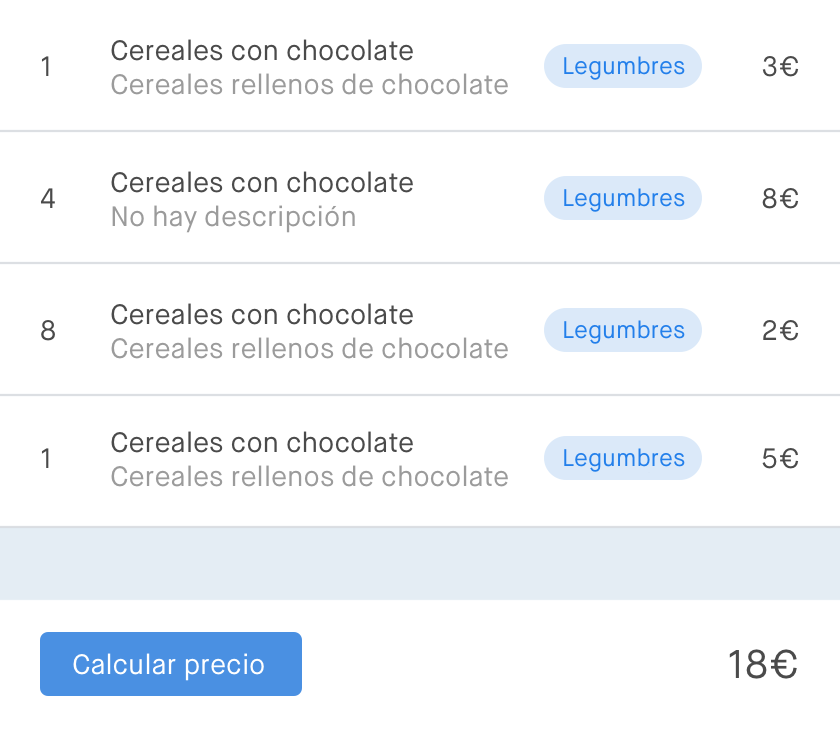

# Tarjeta

## Requisitos

Para este ejercicio es necesario crear un proyecto con [React Create App](https://github.com/facebookincubator/create-react-app). Una vez montado el proyecto, se deberán eliminar los archivos innecesarios (registerServiceWorker.js, logo.svg, etc.)

## Descripción del ejercicio

Vamos a crear una lista de la compra con los productos que hemos comprado. Por cada producto comprado mostraremos los siguientes campos:

- Nombre del artículo (obligatorio)
- Cantidad (obligatorio)
- Categoría (obligatorio)
- descripción (opcional)
- Precio (obligatorio)

El producto tendrá que tener siempre información necesaria para los campos en los que pone obligatorio. Es decir, si esta información nos llegase de una petición a un servidor, esos campos siempre tendrían un valor. Sin embargo, en la descripción, al ser un valor opcional, el servidor puede que nos devuelva un valor o no. Mostraremos un mensaje por defecto de _"No hay descripción"_ cuando no exista un valor para este campo.

Finalmente la lista tendrá que tener un botón que al ser pulsado muestre el precio total de la compra.

El resultado final debe ser parecido al de la imagen que se muestra a continuación.

